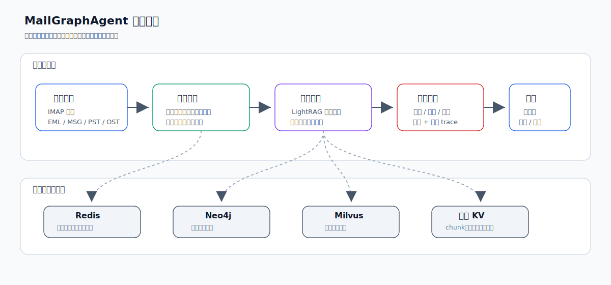
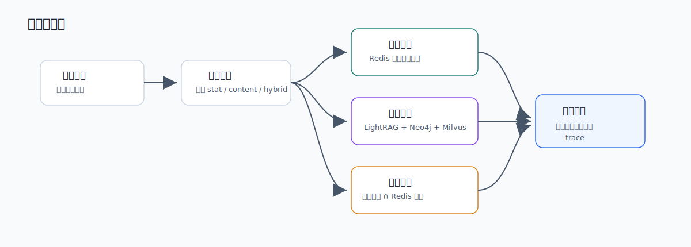

# MailGraphAgent

MailGraphAgent 是一个面向企业邮件的知识图谱与智能查询系统。它把邮箱和本地 Outlook 邮件文件导入进来，抽取邮件正文、附件、人物、客户、项目、任务和风险线索，然后支持用自然语言查询邮件统计、项目进展和关系图谱。

## 系统怎么工作

```text
邮件数据 → 解析清洗 → LightRAG 建图 → Redis / Neo4j / Milvus 支撑查询
```

<p align="center">
  
</p>

这张图只看四步就够了：

| 步骤 | 说明 |
|---|---|
| 邮件来源 | 支持 IMAP 邮箱，也支持 `.eml` / `.msg` / `.pst` / `.ost` 本地邮件文件 |
| 处理管线 | 解析正文、HTML、附件、收发件人和日期，再清洗噪音内容 |
| 知识构建 | LightRAG 增量抽取实体、关系和向量，写入 Neo4j、Milvus 和本地 KV |
| 智能查询 | 用户用自然语言查询，系统返回答案、表格和证据 trace |

## 查询怎么走

<p align="center">
  
</p>

查询分三类：

| 类型 | 适合的问题 | 走哪里 |
|---|---|---|
| 统计查询 | “本周失败邮件有多少？” | Redis 状态、时间、发件人、附件索引 |
| 内容查询 | “华远项目现在有什么风险？” | LightRAG + Neo4j + Milvus |
| 混合查询 | “最近七天带附件的合同邮件有哪些？” | 先用 LightRAG 找主题邮件，再和 Redis 元数据过滤求交集 |

## 为什么不用 RAGFlow GraphRAG

我们实际验证过 RAGFlow 的 GraphRAG 能力：它适合一次性把一批文档构造成数据集级知识图谱，但不适合这个项目的邮件场景。

主要原因：

| 问题 | 对邮件场景的影响 |
|---|---|
| GraphRAG 更新偏全量 | 新邮件持续进入时，触发 GraphRAG 容易变成对整个 dataset 重新构建，30G 邮件量下成本和耗时不可控 |
| 增量行为不透明 | 上传新文档后是否自动更新图谱、什么时候更新、更新了哪些内容，不够可控 |
| 统计查询不适合交给 GraphRAG | “本周失败多少封”“谁发得最多”“带附件的合同邮件有哪些”这类问题需要确定性索引和精确过滤 |
| 证据归属不够直接 | 邮件系统必须知道答案来自哪封邮件、哪个附件、哪个 `message_id`，否则无法做审计和回溯 |
| 图谱展示和工程控制受限 | 项目需要直接控制 Neo4j 图谱、Redis 状态和向量索引，而不是把关键状态藏在平台内部 |

因此当前架构把能力拆开：

```text
RAGFlow 式一体平台
  → 替换为
Redis 做确定性状态和统计
LightRAG 做增量 GraphRAG
Neo4j 做可控图谱
Milvus 做向量召回
本地 KV 做证据兜底
```

这样更贴合邮件系统的核心需求：持续增量导入、可控成本、精确统计、证据可追溯、图谱可展示。

## 核心组件

| 组件 | 作用 |
|---|---|
| Vue 工作台 | 导入邮件、查看处理队列、聊天查询、图谱展示 |
| FastAPI | 提供 REST API 和 SSE 任务进度流 |
| Pipeline | 邮件拉取、文件扫描、解析、清洗、入库编排 |
| Redis | 邮件状态、临时正文、导入队列、统计索引 |
| LightRAG | 增量抽取邮件知识图谱，负责语义检索和 GraphRAG 查询 |
| Neo4j | 持久化实体关系图谱 |
| Milvus | 存储语义向量索引 |
| `data/lightrag` | LightRAG 本地文档状态、chunk、实体和关系缓存 |

## 关键代码

| 模块 | 文件 |
|---|---|
| 后端入口 | `src/backend/app.py` |
| 邮件管线 | `src/backend/pipeline.py` |
| 查询引擎 | `src/backend/ai/query_engine.py` |
| LightRAG 封装 | `src/backend/knowledge/lightrag_wrapper.py` |
| Redis 状态层 | `src/backend/storage/redis_cache.py` |
| 前端工作台 | `src/web` |

## 当前设计状态

- 当前主链路是 LightRAG + Neo4j + Milvus，不再依赖 RAGFlow GraphRAG。
- Redis 是邮件处理状态和统计查询的单一事实源。
- Hybrid 查询会先把主题证据归属到 `message_id`，再和 Redis 元数据过滤结果求交集。
- 附件文本和邮件正文都会进入 LightRAG。
- LightRAG 查询失败或结构化结果缺少 chunk 时，会回退读取 `data/lightrag` 本地 KV，尽量保留证据来源。
